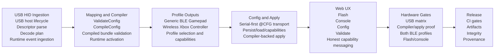

# Dependency Graph

This graph freezes the implementation dependency order for the amended target product outcome.

## Stage Notes

| Stage | Why it comes first | Primary implementation owners |
|---|---|---|
| USB HID ingestion | Everything downstream depends on stable physical input semantics. | `components/charm_platform_usb`, `components/charm_app`, existing unit tests |
| Mapping and compiler | Profiles and config/apply need a real compiled mapping artifact, not a stub or fake bundle ref story. | `components/charm_core`, `tests/unit` |
| Profile outputs | Config/apply must target real selectable output profiles, not placeholder IDs. | `components/charm_core`, `components/charm_platform_ble`, `tests/unit` |
| Config and apply | Web UX cannot truthfully expose compile/apply flows until firmware owns the real serial contract. | `CONFIG_TRANSPORT_CONTRACT.md`, `components/charm_app`, `components/charm_platform_storage`, web serial adapter |
| Web UX | UI must reflect only capabilities that firmware and transport already support. | `charm-web-companion/components`, `charm-web-companion/lib`, vitest suite |
| Hardware gates | Physical proof comes after the code paths and UI contracts stabilize. | `HARDWARE_VALIDATION_PACK.md`, retained evidence artifacts |
| Release | Release claims are only valid after hardware and CI gates are complete. | GitHub workflows, release scripts, docs |

## Blocking Rules

- Do not implement profile-specific UI before the profile encoders and selection contract exist.
- Do not widen config/apply UI before the serial-first firmware contract is frozen.
- Do not claim release readiness before both target profiles and compiler/apply flows have retained hardware proof.
