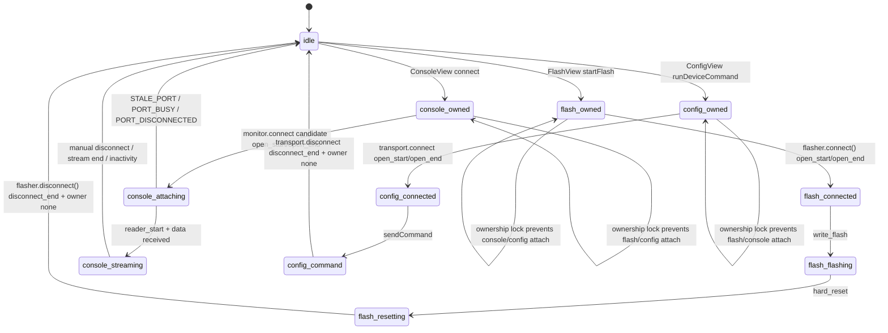

# Serial Lifecycle State Machine (Flash / Console / Config)

## Key invariants
- Only one owner can hold serial at a time (`none|flash|console|config`).
- Every error path attempts deterministic unwind (`reader.cancel`/`releaseLock`/`close`).
- Structured logs are emitted for owner changes, open/close, reader start/end, and disconnect reasons.
