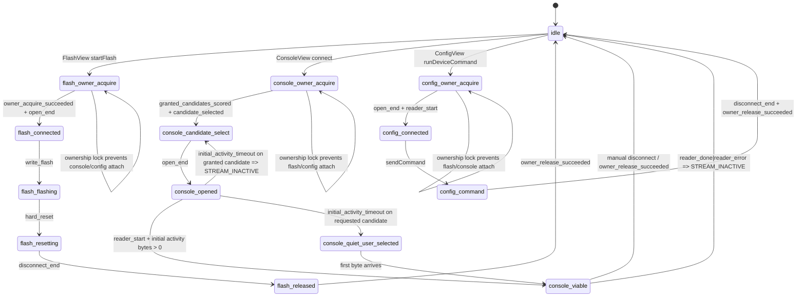

# Serial Lifecycle State Machine (Flash / Console / Config)

## Key invariants
- Only one owner can hold serial at a time (`none|flash|console|config`).
- Console "Connected" now requires stream viability (`reader_start`) and candidate qualification, not `port.open()` alone.
- Auto-selected granted ports that remain inactive are treated as `STREAM_INACTIVE` candidates and rejected.
- Requested ports can remain connected-but-quiet to support firmware that intentionally emits no logs.
- Every error path attempts deterministic unwind (`reader.cancel`/`releaseLock`/`close`) and emits lifecycle logs with port identity.
